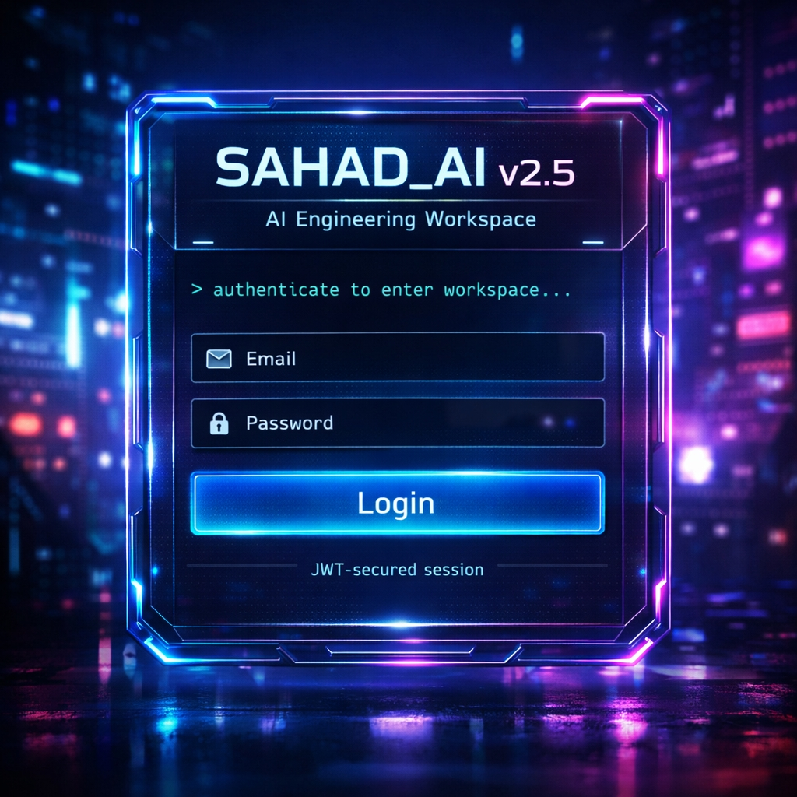
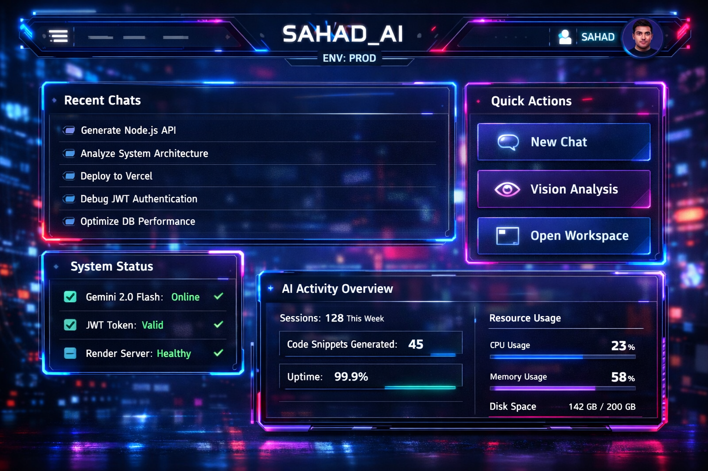
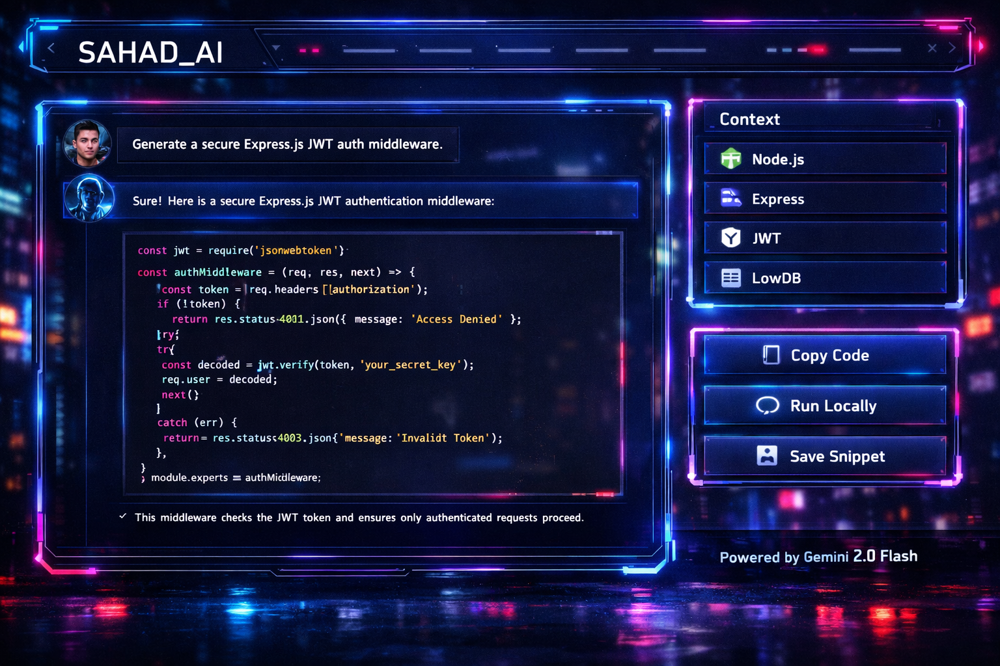
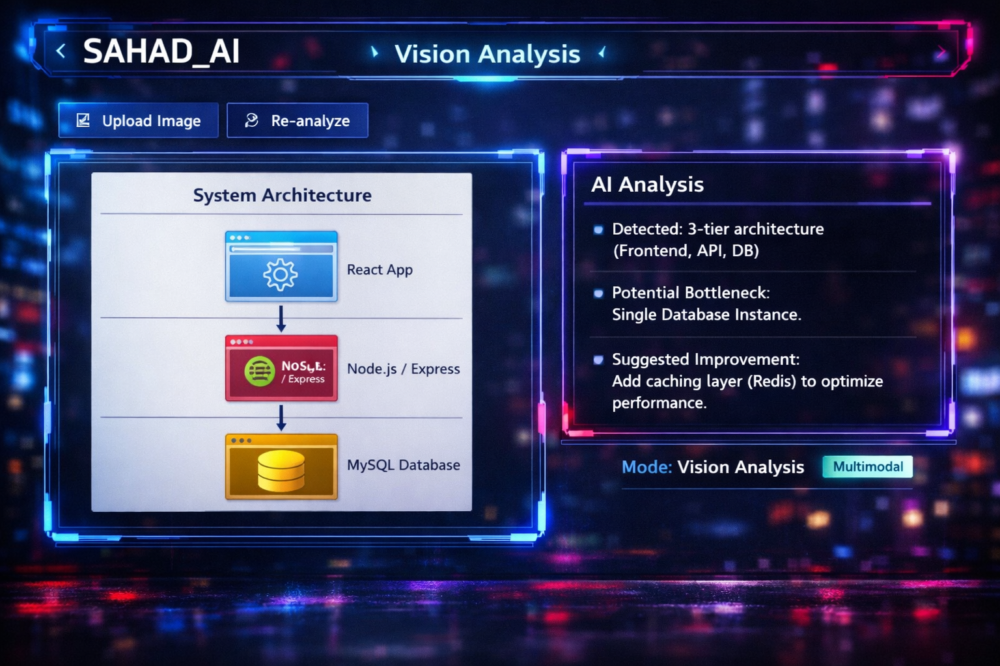
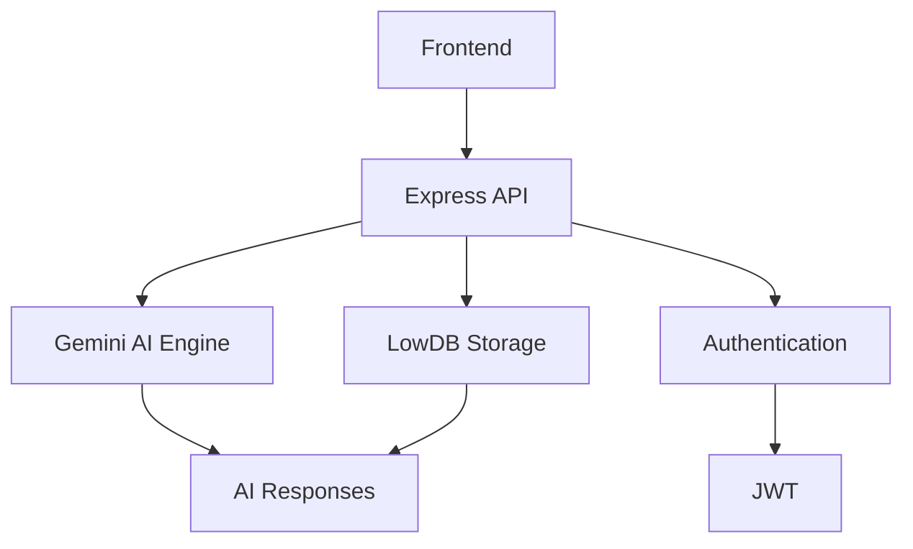

# 🌌 SAHAD_AI v2.5

<div align="center">

# ⚡ SAHAD_AI v2.5

### AI-Powered Full-Stack Development Workspace

Modern AI engineering platform powered by Gemini 2.0 Flash with multimodal intelligence, JWT authentication, cloud deployment, and a futuristic developer experience.

<br>


</div>

---

# 🚀 Overview

SAHAD_AI is a modern AI engineering workspace designed for developers, architects, cloud engineers, and AI enthusiasts.

The platform combines:

- 🧠 Gemini 2.0 Flash
- 👁️ Multimodal Vision Analysis
- 🔐 JWT Authentication
- ⚡ Real-Time AI Responses
- ☁️ Cloud Deployment
- 🎨 Cyberpunk UI
- 💻 Developer Productivity Tools

---

# 📸 Screenshots

> Replace the image paths below with actual screenshots from your project.

## Login Screen



## Dashboard



## AI Workspace



## Vision Analysis



## Mobile Experience


---

# ✨ Features

## 🤖 AI Features

- Gemini 2.0 Flash Integration
- Context-Aware Conversations
- Code Generation
- Debugging Assistance
- Architecture Suggestions
- Vision Understanding
- Screenshot Analysis

## 🔐 Security Features

- JWT Authentication
- Protected Routes
- Secure Middleware
- Environment Isolation
- Token Expiration
- API Protection

## 💻 Developer Experience

- Responsive Interface
- Copy-to-Clipboard Actions
- Syntax Highlighting
- Mobile Optimized
- Modern UI Components

---

# 🏗️ Architecture



---

# ⚙️ Tech Stack

## Frontend

```bash
HTML5
Tailwind CSS
JavaScript
```

## Backend

```bash
Node.js
Express.js
JWT
LowDB
Google Generative AI SDK
```

## Infrastructure

```bash
Render
GitHub
Environment Variables
```

---

# 📂 Project Structure

```bash
project-root/

├── public/
│   ├── index.html
│   ├── style.css
│   └── app.js
│
├── routes/
│   └── api.js
│
├── middleware/
│   └── auth.js
│
├── services/
│   └── gemini.js
│
├── database/
│   └── db.json
│
├── utils/
│   └── helpers.js
│
├── .env
├── package.json
├── server.js
└── README.md
```

---

# 🔑 Environment Variables

Create a `.env` file:

```env
API_KEY=your_google_gemini_api_key
JWT_SECRET=super_secure_secret
MY_PASSWORD=your_password
PORT=3000
```

---

# 📦 Installation

Clone the repository:

```bash
git clone https://github.com/Dev-Sahad/Sahad-Ai-v2.5.git
```

Enter project directory:

```bash
cd Sahad-Ai-v2.5
```

Install dependencies:

```bash
npm install
```

Start development server:

```bash
node server.js
```

---

# ☁️ Render Deployment

## Build Command

```bash
npm install
```

## Start Command

```bash
node server.js
```

---

# 🔌 API Overview

## Authentication

```http
POST /login
```

Returns:

```json
{
  "token": "jwt_token"
}
```

---

## AI Chat

```http
POST /api/chat
```

Example:

```json
{
  "message": "Generate a Node.js API"
}
```

---

## Vision Analysis

```http
POST /api/vision
```

Upload an image and receive AI-powered analysis.

---

# 🛡 Security

SAHAD_AI follows security best practices:

- JWT Session Authentication
- Secure Middleware Protection
- Environment Variable Isolation
- Request Validation
- Protected API Routes

---

# 🗺️ Roadmap

## Version 3.0

- [ ] Voice AI
- [ ] Docker Support
- [ ] Redis Caching
- [ ] Multi-User Accounts
- [ ] WebSocket Streaming
- [ ] Team Collaboration
- [ ] File Processing

---

# 🤝 Contributing

Contributions are welcome.

```bash
fork ➜ create branch ➜ commit ➜ push ➜ pull request
```

---

# 👨‍💻 Developer

## Muhammad Sahad

Full-Stack Developer • AI Developer • Open Source Builder

GitHub:

https://github.com/Dev-Sahad

---

# ⭐ Support

If you find this project useful:

```text
⭐ Star the repository
🍴 Fork the project
🛠 Contribute improvements
```

---

# 📄 License

MIT License

Copyright (c) 2026 Muhammad Sahad

---

<div align="center">

## 🌌 SAHAD_AI

"Architecture is not just code.
It is the intelligence behind every interaction."

</div>